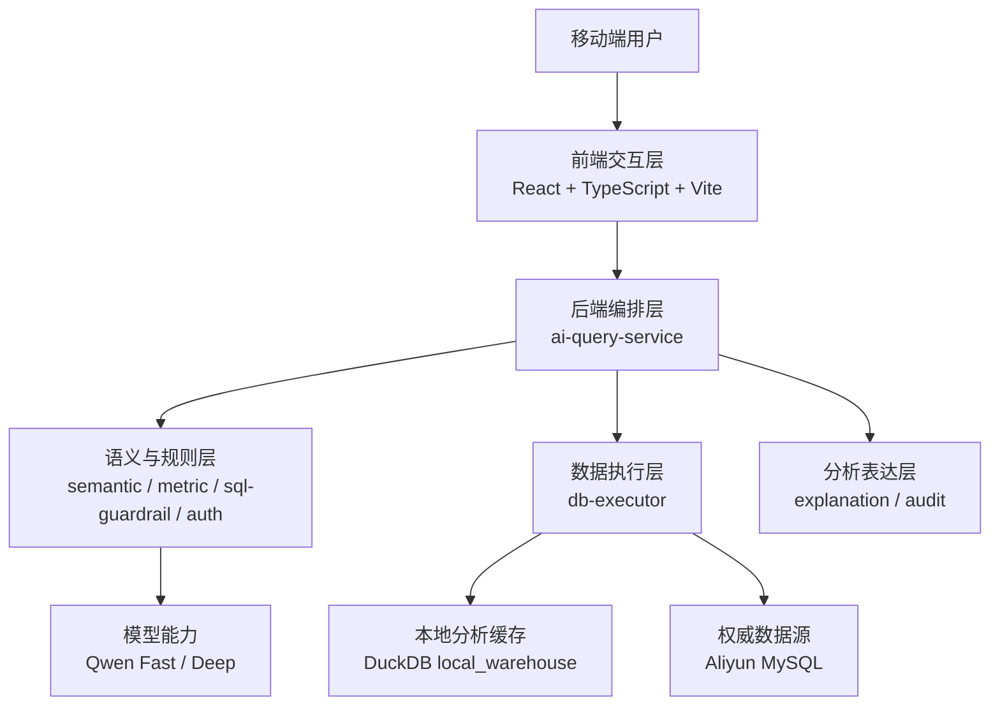
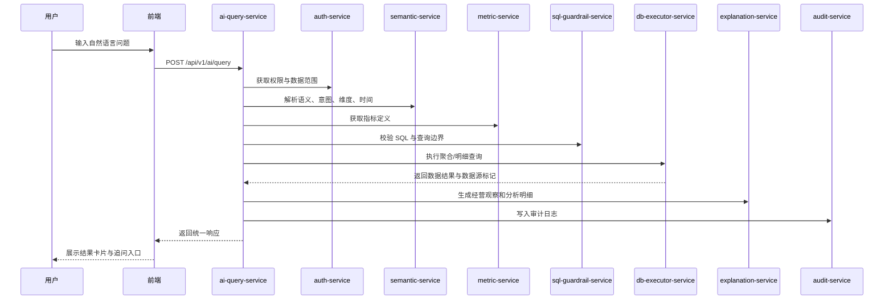
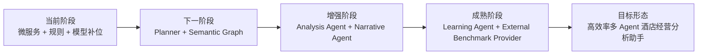

# 酒店经营 AI 助手架构总览

本文档用于从“实际落地代码”视角梳理整个项目的系统架构，重点回答四个问题：

1. 这个项目现在由哪些层组成。
2. 一次用户提问会经过哪些服务。
3. 数据、模型、缓存分别放在什么位置。
4. 下一步最值得重构和增强的重点是什么。

建议和以下文档配合阅读：

- `PROJECT_REVIEW_AND_ARCHITECTURE.md`
- `../03_SEMANTIC_AND_MODEL/SEMANTIC_DIMENSION_LAYER.md`
- `../03_SEMANTIC_AND_MODEL/LLM_REASONING_BOUNDARY.md`
- `../02_ARCHITECTURE_EVOLUTION/HIGH_EFFICIENCY_MULTI_AGENT_ARCHITECTURE.md`

## 1. 项目定位

这是一个面向酒店集团管理层的移动端经营分析助手。

它的目标不是让用户配置很多筛选参数，而是让用户直接用自然语言提问，例如：

- “看一下江门嘉华酒店 3 月的经营情况”
- “查一下 1 月份富力所有酒店的总体经营情况”
- “只看华南区”
- “继续展开原因”

系统负责完成：

- 识别业务对象：酒店、区域、品牌、子品牌、管理公司、部门、科目、时间范围
- 判断分析意图：总览、归因、对比、摘要、报告、追问
- 查询真实经营数据
- 输出适合管理层阅读的经营分析

## 2. 总体分层

从代码和运行结构看，当前项目可以分为 5 层：

### 2.1 前端交互层

职责：

- 提供移动优先的对话式输入
- 展示管理层结果卡片
- 承接连续追问、快速筛选、快捷提问
- 把技术调试信息收进折叠区，避免打断阅读

核心文件：

- `frontend/src/App.tsx`
- `frontend/src/lib/api.ts`
- `frontend/src/components/QuickQuestions.tsx`
- `frontend/src/styles.css`
- `frontend/tests/management-chat.spec.ts`

### 2.2 后端编排层

职责：

- 接收统一查询请求
- 编排权限、语义解析、指标映射、SQL 校验、数据查询、分析生成、审计写入
- 汇总成前端可消费的统一响应

当前编排中枢：

- `backend/apps/ai-query-service`

### 2.3 语义与规则层

职责：

- 把自然语言解析成结构化查询参数
- 维护指标字典、维度映射和 SQL 安全边界
- 决定哪些地方由规则处理，哪些地方交给模型推理

相关服务：

- `semantic-service`
- `metric-service`
- `sql-guardrail-service`
- `auth-service`

### 2.4 数据执行层

职责：

- 执行最终查询
- 优先命中本地分析缓存
- 本地缓存不可用时再回源 MySQL

相关服务：

- `db-executor-service`

### 2.5 分析表达层

职责：

- 基于真实结果做经营分析拆解
- 输出管理层能直接阅读的结构化结论
- 记录查询元数据和审计信息

相关服务：

- `explanation-service`
- `audit-service`

## 3. 后端微服务拆解

当前后端由 8 个 FastAPI 服务组成。

| 服务 | 默认端口 | 核心职责 |
| --- | --- | --- |
| `ai-query-service` | 8100 | 对外统一入口，负责整条查询链路编排 |
| `semantic-service` | 8101 | 自然语言解析，输出 `parsed_intent`、`query_plan`、`resolved_entities` |
| `metric-service` | 8102 | 指标字典和字段映射 |
| `sql-guardrail-service` | 8103 | SQL 合规校验与口径约束 |
| `explanation-service` | 8104 | 经营观察、分析明细、风险提示、摘要生成 |
| `auth-service` | 8105 | 角色、权限、数据范围返回 |
| `db-executor-service` | 8106 | DuckDB / MySQL 查询执行 |
| `audit-service` | 8107 | 审计与链路元数据记录 |

### 3.1 当前启动方式

项目通过 `scripts/start_backend.ps1` 启动 8 个后端服务。

特点：

- 统一读取 Windows User 环境变量中的模型和数据库配置
- 每个服务独立端口运行
- 本地开发和演示环境部署简单

这是一种轻量微服务方式，适合当前交付和快速迭代，但后续如果进入正式生产环境，还需要加入：

- 统一配置中心
- 服务发现或网关
- 健康检查聚合
- 更清晰的日志和链路追踪

## 4. 一次查询的调用链

一次典型用户请求的执行流程如下：

### 4.1 当前统一响应的关键部分

一般会包含这些字段：

- `parsed_intent`
- `query_plan`
- `resolved_entities`
- `data_source`
- `rows`
- `summary`
- `analysis`
- `quick_filters`
- `performance`

这意味着当前系统已经不只是“返回 SQL 查询结果”，而是在返回一份包含语义理解、数据事实和展示建议的完整响应对象。

## 5. 数据架构

当前数据层是“双层架构”。

### 5.1 权威数据源

来源：阿里云 MySQL

主要对象：

- `wddm_dim_overview_cockpit_f`
- `vw_pnl_fact`
- `dim_allhotel_slcp`

职责：

- 作为真实经营数据的权威来源
- 承载经营概览、P&L 明细和酒店维度

### 5.2 本地分析缓存

来源：同步 MySQL 后生成的 DuckDB

目录：

- `backend/runtime/warehouse`

主要文件：

- `hotel_warehouse.duckdb`
- `sync_manifest.json`

职责：

- 提升在线问答速度
- 减少频繁直接访问远程 MySQL
- 支撑本地分析型查询和组合聚合

当前查询优先级：

1. `local_warehouse`
2. `database`
3. `real_csv`
4. `fallback`

这也是当前系统能把常见问题响应压到秒级以内的关键原因。

## 6. 语义理解架构

当前语义解析已经不只是识别“酒店 + 月份 + 指标”。

### 6.1 当前已支持的核心维度

经营概览维度：

- 酒店
- 区域
- 管理公司/管理类别
- 品牌/子品牌
- 建设来源
- 品牌档次
- 城市等级

P&L 分析维度：

- 部门
- 科目
- 科目上级层级

### 6.2 当前语义输出结构

当前系统会逐步输出：

- `parsed_intent`
- `query_plan`
- `resolved_entities`

可以把它理解成三层：

1. `parsed_intent`
   识别出问题表面参数，例如酒店、月份、指标、口径

2. `query_plan`
   判断这到底是单酒店、组合、区域还是摘要类问题，以及先汇总还是先下钻

3. `resolved_entities`
   把“富力所有酒店”“华南区万达管理嘉华品牌”这类对象解析成真正可查询的业务集合

这正是系统从“死板匹配”往“理解式查询”演进的关键节点。

## 7. 模型架构

当前模型不是单一大模型直连数据库，而是“双模型 + 规则兜底”的模式。

### 7.1 快模型

建议模型：

- `qwen3.5-flash`

职责：

- 自然语言容错
- 低置信场景补充解析
- 口径澄清和连续追问改写

### 7.2 深模型

建议模型：

- `qwen3.6-plus`

职责：

- 经营分析表达
- 结构化结论生成
- 报告和摘要组织

### 7.3 当前原则

- 能通过规则和维度图谱确定的，不让模型猜
- 模糊、歧义、组合语义，再让模型推理
- 模型不直接充当数据库事实来源
- 深模型必须在已返回真实数据基础上表达，不应凭空补事实

## 8. 前端呈现架构

前端现在不是调试台，而是在往“管理层移动经营助手”收敛。

当前主要结构：

1. 对话输入区
2. 快捷提问
3. 经营观察
4. 关键指标卡片
5. 重点酒店 / 对标 / 异常拆解
6. 折叠的分析明细
7. 折叠的继续追问与快速筛选
8. 折叠的技术诊断信息

这样做的目的，是把首屏注意力集中在：

- 我现在看到什么
- 当前经营有哪些客观观察
- 我下一步还能怎么问

而不是让技术字段占据界面。

## 9. 当前架构的优点

### 9.1 已经具备比较清晰的分层

前端、编排、语义、数据、分析、审计是拆开的，后续可持续迭代。

### 9.2 真实数据链路已经打通

不是样例演示系统，而是已经能查真实 MySQL 和本地 DuckDB。

### 9.3 性能已经有明显改善基础

本地分析缓存和服务拆分，让常见问题可以走快速路径。

### 9.4 已开始具备语义理解能力

`query_plan` 和 `resolved_entities` 的引入，说明系统已经在从“关键词查数”升级成“先理解再查询”。

## 10. 当前仍然存在的主要不足

### 10.1 语义理解还不够彻底

虽然已经有 `query_plan`，但整体仍偏向“先识别字段，再拼查询”，真正的 Query Planner 还没有完全独立出来。

### 10.2 多服务已经出现，但多 agent 还未真正成型

现在更接近“微服务编排”，还不是“理解、规划、查询、分析、表达”清晰分工的多 agent 架构。

### 10.3 配置仍偏多

虽然已经抽出 `app_settings.yaml`、字典、语义映射，但系统的自学习和自动吸收反馈能力还不强。

### 10.4 生产化能力仍需补齐

包括但不限于：

- 更强的权限体系
- 服务治理
- 监控告警
- 数据同步调度
- 外部行业对标 Provider
- 可回放的评测集和学习闭环

## 11. 下一步最值得做的重构重点

建议按优先级分三层推进。

### 第一优先级：把理解层独立出来

重点：

- 正式做 `Query Planner`
- 正式做 `Semantic Graph`
- 让 skill 回归“执行模板”角色，而不是承担问题理解

目标：

- 让系统先判断“你到底想看什么”，再决定怎么查

### 第二优先级：把经营分析层独立出来

重点：

- 做 `Analysis Agent`
- 做 `Narrative Agent`
- 统一“收入质量 / 客房效率 / 利润质量 / 成本效率 / 横向对标”分析框架

目标：

- 让结果越来越像专业酒店经营分析师的表达，而不是机械模板

### 第三优先级：把学习闭环接起来

重点：

- 建立低置信问题收集
- 记录空结果与用户纠正
- 把样本沉淀成新 alias、新 planner pattern、新 eval case

目标：

- 让系统越来越懂真实业务表达，而不是持续靠人工补规则

## 12. 建议的目标演进图

## 13. 一句话总结

当前项目已经完成了“移动端对话入口 + 真实数据查询 + 初步语义理解 + 管理层结果呈现”的基础架构。

它的下一步重点，不再是继续堆更多规则或更多快捷问题，而是把系统真正升级成：

“一个会先理解业务问题、再规划查询路径、再基于真实数据做经营拆解，并能持续学习用户表达的酒店经营分析助手。”
