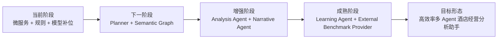

# 酒店经营 AI 助手阶段回归与推进记录

## 1. 阶段路线

## 2. 当前完成度回顾

| 阶段 | 状态 | 已完成内容 | 主要缺口 |
| --- | --- | --- | --- |
| A. 微服务 + 规则 + 模型补位 | 基本完成，可继续加固 | 前后端服务拆分、语义解析入口、规则解析、Qwen 模型补位、真实数据库/本地仓库读取、移动端问答界面、经营结果结构化输出 | 规则仍偏静态，复杂自然语言问题的解释链路还不够透明 |
| B. Planner + Semantic Graph | 已启动，进行中 | 已建立语义层、维度识别、快速筛选模板、会话级上下文、部分 Planner 化查询口径 | Planner 还需要从“规则路由”升级到“任务计划 + 证据选择 + 查询分解” |
| C. Analysis Agent + Narrative Agent | 设计完成，部分能力已内嵌 | 结果中已包含经营观察、内部对标、组合拆解、异常酒店提示、专业酒店经营视角 | 还未拆成独立 Analysis Agent / Narrative Agent，分析质量仍依赖单次接口返回 |
| D. Learning Agent + External Benchmark Provider | 设计完成，尚未完整落地 | 已预留外部行业对标开关、系统配置、技能/Harness/Hermes 演进方案 | 缺少外部 Provider 接入、用户反馈闭环、可审计的学习沉淀机制 |
| E. 高效率多 Agent 酒店经营分析助手 | 目标形态 | 已明确高效率编排原则：快路径先响应，慢路径异步补充 | 需要完成 Planner、Agent 编排、外部数据、学习闭环后才能达到 |

## 3. 本轮推进内容

本轮优先推进“基础交互体验向 ChatGPT 看齐”的 P0 能力，因为它是多 Agent 助手可用性的底座。

已推进：

1. 前端从单一消息流升级为多会话结构。
2. 每个会话独立维护消息历史和经营上下文。
3. 新建会话后不会继承旧会话的二次追问上下文。
4. 会话列表支持移动端横向滑动、最近会话排序和自动标题。
5. 当前会话显示“范围 / 时间 / 指标 / 口径”的上下文快照。
6. 前端交互测试补充新建会话、切换会话、上下文隔离场景。
7. 语义服务的 `query_plan` 增加 Planner 契约字段，包括 `intent`、`metrics`、`filters`、`query_steps`、`fast_path`、`async_path`、`evidence_needed`，为后续多 Agent 编排提供稳定输入。

## 4. 下一步开发优先级

### 快路径，必须保持快

这些步骤直接影响用户等待体验，应尽量控制在 1-3 秒内完成：

1. 用户输入后立即展示已理解的范围、时间、指标、口径。
2. 快速模型或规则层完成初步意图识别。
3. Planner 输出最小查询计划。
4. 返回第一屏经营观察。
5. 给出“你可以继续问”的轻量筛选建议。

### 慢路径，可以异步补充

这些步骤价值高，但不应阻塞第一屏：

1. 更深层归因分析。
2. 跨区域、跨品牌、跨档次的横向对标。
3. 外部行业行情获取。
4. Narrative Agent 对表达质量进行二次润色。
5. Learning Agent 从用户追问、纠错、常用筛选中沉淀配置。

## 5. 后续推进建议

下一轮建议进入 B 阶段的深水区：把当前的语义层继续升级为真正的 Planner + Semantic Graph。

重点任务：

1. Planner 明确输出 `intent`、`scope`、`time_range`、`metrics`、`comparison_mode`、`query_steps`、`evidence_needed`。
2. Semantic Graph 统一管理管理公司、区域、品牌、子品牌、档次、酒店、科目上下级。
3. 查询前先做实体消歧，例如“富力所有酒店”应映射为公司/集团口径，而不是文本模糊匹配。
4. 查询后由 Analysis Agent 做收入质量、客房效率、利润质量、成本效率、内部横向对标拆解。
5. Narrative Agent 只负责把证据组织成管理层易读的表达，不自行编造结论。
6. External Benchmark Provider 默认关闭，由用户主动开启，并在结果中标注来源、时效和可信度。

## 6. 当前风险

1. 如果 Planner 仍停留在硬编码规则，复杂经营问题会继续出现“能答常见问法，但不理解业务口径”的问题。
2. 如果 Semantic Graph 不统一，管理公司、品牌、子品牌、区域、酒店、科目上下级会在不同模块重复解析，导致结果不一致。
3. 如果所有深度分析同步执行，15-20 秒等待会让移动端体验变差。
4. 如果外部行业数据不做来源和时效标注，容易让用户误以为它与内部真实经营数据同等可靠。

## 7. 阶段结论

当前项目已经从 A 阶段进入 B 阶段，但 B 阶段还没有完全成熟。短期应继续沿着“快路径先返回、慢路径异步补充”的方式推进，让系统先具备稳定、可解释、可持续追问的 Planner + Semantic Graph 能力，再逐步拆出 Analysis Agent、Narrative Agent、Learning Agent 和 External Benchmark Provider。
