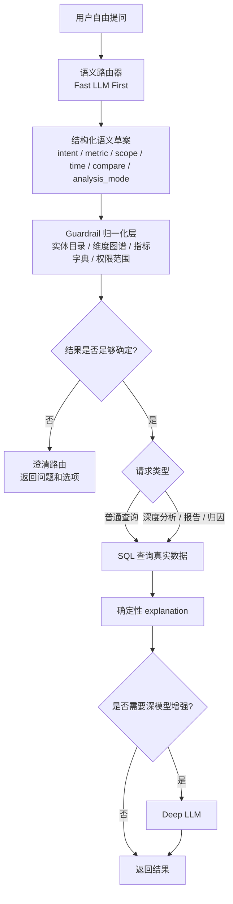

# 语义路由重构方案

## 1. 背景

当前项目已经支持酒店经营问答、管理摘要、归因分析和连续追问，但现有语义链路的默认思路仍然偏向：

```text
规则优先，低置信时再调用快模型补位。
```

这套思路在“用户问题相对标准、问法较稳定”的场景下是成立的，但前端一旦开放成接近自然聊天的输入方式，问题分布会明显变化：

- 用户会口语化提问，而不是按指标模板提问。
- 用户会省略时间、范围和口径，默认依赖上下文。
- 用户会混用业务表达、管理表达和模糊表达。
- 用户会频繁追问，例如“继续看原因”“换成同比”“只看华南区”。
- 用户会直接问结论，例如“这是不是有风险”“哪些店拖后腿”。

在这种输入分布下，规则不再适合作为主解析器。问题不在于规则写得不够多，而在于主链路对输入分布的假设已经变化。

## 2. 当前问题定义

当前链路的核心问题有四个：

### 2.1 规则主导不适合开放式输入

规则匹配更适合显式词命中，例如：

- 酒店名
- 区域名
- 指标名
- 同比 / 预算 / 本月

但真实用户输入常常是：

- “最近富力整体表现怎么样”
- “是不是餐饮这块拖了利润”
- “把刚才那个换成华南区看看”
- “我想给领导汇报一下这月的问题”

这类问题往往不含完整结构字段，或者字段顺序不稳定，规则很难先天覆盖。

### 2.2 当前快模型角色偏被动

现有 `semantic-service` 中，快模型更像“低置信规则兜底器”，而不是“开放语义归一化器”。

结果是：

- 模型参与率取决于规则是否先失败。
- 规则一旦误命中，高置信错误反而可能跳过模型修正。
- 用户问法越自然，规则越容易把问题错误地拉回到默认模板。

### 2.3 澄清逻辑仍偏规则式

当前澄清主要围绕：

- 范围缺失
- 口径缺失
- 指标过泛

但开放式对话下还会出现更多需要澄清的情况：

- 用户是在问数据，还是在要结论。
- 用户是在延续上轮上下文，还是想切换主题。
- 用户提到的词是品牌、酒店、管理口径还是抽象类别。
- 用户是要看快照、归因、汇报摘要还是行动建议。

### 2.4 规则与模型的职责边界需要重排

当前边界更接近：

```text
规则负责主解析，模型负责补位。
```

更适合当前前端场景的边界应该是：

```text
模型负责开放式语义归一化，
规则 / 字典 / 权限 / 图谱负责约束、校验和纠偏。
```

## 3. 重构目标

本轮语义路由重构建议围绕五个目标展开：

1. 适配前端自由提问，而不是只适配标准查询句式。
2. 让小模型成为主语义路由器，但不直接放开到底层 SQL。
3. 保留规则、实体目录、维度图谱和权限范围作为强约束层。
4. 把“是否需要深分析”从语义解析阶段就初步识别出来。
5. 让连续追问、改口径、缩范围、换分析模式成为一等能力。

## 4. 推荐方案

### 4.1 总体思路

建议把当前链路从：

```text
rule-first -> low confidence llm fallback
```

调整为：

```text
llm-first semantic routing -> guardrail normalization -> query / clarification / deep analysis routing
```

也就是：

- 第一层先让快模型理解“用户到底想干什么”。
- 第二层再用规则、字典、图谱和权限做结构化校验。
- 第三层决定是直接查数、先澄清，还是进入深分析。

### 4.2 推荐链路



## 5. 语义路由分层设计

### 5.1 第一层：Fast LLM 语义归一化

职责：

- 理解开放式自然语言问题。
- 补全隐含意图。
- 判断当前问题是否在承接上轮上下文。
- 将结果收敛为结构化 JSON。
- 提前判断是否需要澄清。

这一层不直接负责最终字段合法性，只负责把用户原话转成“候选语义结构”。

建议输出字段：

- `intent`
- `metric_code_candidate`
- `scope_candidates`
- `time_scope_candidate`
- `compare_mode_candidate`
- `analysis_mode_candidate`
- `analysis_focus_candidate`
- `conversation_action`
- `needs_clarification`
- `clarification_reason`
- `confidence`

建议新增的 `conversation_action`：

- `new_query`
- `follow_up_continue`
- `refine_scope`
- `shift_compare_mode`
- `switch_metric`
- `switch_analysis_mode`
- `management_summary`

### 5.2 第二层：Guardrail 归一化和纠偏

职责：

- 把模型输出映射到系统允许的枚举值。
- 用实体目录、别名表和维度图谱做实体归一。
- 检查酒店、区域、品牌、管理公司之间是否冲突。
- 检查指标是否存在，时间是否可解析，权限是否允许。
- 对模糊值做回退或候选保留。

这一层不追求“理解用户”，而追求“把模型结果落到系统可以执行的结构上”。

建议保留的确定性能力：

- 酒店、区域、品牌、管理公司、部门、科目识别
- 时间标准化
- 指标字典校验
- SQL 安全边界
- 权限范围校验
- 冲突检测

### 5.3 第三层：澄清路由

在当前前端场景下，澄清不应只在规则缺字段时触发，而应在以下情况统一触发：

- 范围冲突，例如区域和酒店不一致。
- 指标候选不唯一。
- 用户要求“表现怎么样”但没有明确对象。
- 用户明显承接上下文，但上下文锚点不足。
- 用户要求结论或建议，但当前没有对应数据基础。

澄清输出建议统一为：

- `clarification_type`
- `clarification_question`
- `clarification_options`
- `missing_slots`
- `candidate_interpretations`

### 5.4 第四层：查询与分析路由

语义路由完成后，再按请求类型分流：

- `query`: 直接查数，走确定性 explanation。
- `report`: 查数后优先组织摘要结构，必要时启用深模型。
- `explain`: 查数后优先进入归因分析模板，必要时启用深模型。
- `rank`: 查数后进入排序/梯队/拖累项视图。

关键变化是：是否启用深模型，不由“有没有配置模型”决定，而由“当前问题是否真的需要深推理”决定。

## 6. 推荐的路由策略

### 6.1 不再只保留 rule-first / fallback 二元逻辑

建议把语义解析升级为四档路由：

1. `deterministic`
   适用于非常标准的短问题，规则直接可解。

2. `fast_llm_parse`
   适用于大多数自然语言问题，由小模型先归一化。

3. `clarification`
   适用于字段缺失、范围冲突、多候选歧义。

4. `deep_reasoning`
   适用于管理摘要、归因解释、结论生成、行动建议。

### 6.2 默认策略建议

面向真实前端使用时，建议默认优先级为：

```text
fast_llm_parse > deterministic shortcut > clarification > deep_reasoning
```

解释：

- 默认让快模型先吸收口语化输入。
- 对极标准、低成本问题可以保留 deterministic shortcut。
- 深模型只在数据返回后按场景启用，不提前介入。

## 7. 数据契约建议

为了支持这套重构，建议把当前 `parsed_intent` 扩展成两层结构：

### 7.1 路由层输出

```json
{
  "route_mode": "fast_llm_parse",
  "conversation_action": "refine_scope",
  "needs_clarification": false,
  "confidence": 0.84,
  "semantic_notes": ["用户在承接上一轮话题，当前意图是收窄范围到华南区。"]
}
```

### 7.2 执行层输出

```json
{
  "intent": "query",
  "metric_code": "OWNER_PROFIT",
  "compare_mode": "yoy",
  "time_scope": "202603",
  "requested_areas": ["华南区"],
  "requested_hotels": [],
  "analysis_mode": "portfolio_overview",
  "analysis_focus": "scope_refinement"
}
```

这样可以区分：

- 系统是如何理解对话动作的。
- 系统最终准备如何执行查询。

## 8. 对现有服务的改造建议

### 8.1 semantic-service

建议从“规则主解析器”调整为“语义路由器 + guardrail 归一化器”。

重点改动：

- 把 `call_llm_parse()` 从 fallback 调整为主流程之一。
- 拆分 `rule_result` 和 `semantic_draft` 的职责。
- 新增 `route_mode`、`conversation_action`、`clarification_type`。
- 把当前 `should_use_llm_parse()` 改造成路由决策器，而不是简单开关。

### 8.2 ai-query-service

建议增强两类能力：

- 消费新的语义路由字段，例如 `route_mode` 和 `conversation_action`。
- 在 trace 中记录“本次为什么进入 clarification / query / deep enhancement”。

### 8.3 explanation-service

建议保持“确定性 first，深模型增强 second”的大方向不变。

这一层的问题不在于方向错了，而在于它需要消费更清晰的上游语义标签，例如：

- 当前是普通查询、摘要、归因还是报告。
- 当前是在延续上轮，还是开启新主题。
- 当前是否需要管理层结论，而不仅是事实说明。

## 9. 实施建议

建议分三步推进：

### 9.1 第一步：补文档和数据契约

- 定义新的语义路由字段。
- 明确 `route_mode`、`conversation_action`、`clarification_type` 的枚举。
- 确认前端、`ai-query-service`、`semantic-service` 的契约。

### 9.2 第二步：并行保留旧链路

- 保留现有 rule-first 逻辑作为对照组。
- 新增 `semantic_routing_version=v2` 开关。
- 在评测和真实使用中对比两套解析效果。

### 9.3 第三步：切换默认策略

当 `v2` 在下列指标上稳定优于旧链路后，再切换默认：

- 首轮命中率
- 澄清率
- 空结果率
- 连续追问成功率
- 平均响应时延

## 10. 风险与边界

### 10.1 风险

- 小模型成为主语义入口后，成本会上升。
- 结构化 prompt 设计不稳时，模型输出可能抖动。
- 如果 guardrail 不够强，模型误判会更早进入执行层。

### 10.2 约束

无论是否采用 LLM first，以下边界都不应放松：

- 指标必须来自系统字典。
- 实体必须经过目录或图谱归一。
- SQL 必须通过 guardrail。
- 深模型只能基于已返回数据生成分析，不得编造事实。

## 11. 结论

当前前端已经更接近开放对话入口，而不是规则模板输入框。

因此，语义路由的主设计原则应从：

```text
如何让规则尽量先匹配成功
```

调整为：

```text
如何让小模型先理解用户真实意图，
再由规则、图谱、权限和字典把结果压回可执行范围。
```

这不是“削弱规则”，而是把规则放回更适合的位置：从主解析器降级为强约束和审计层。
