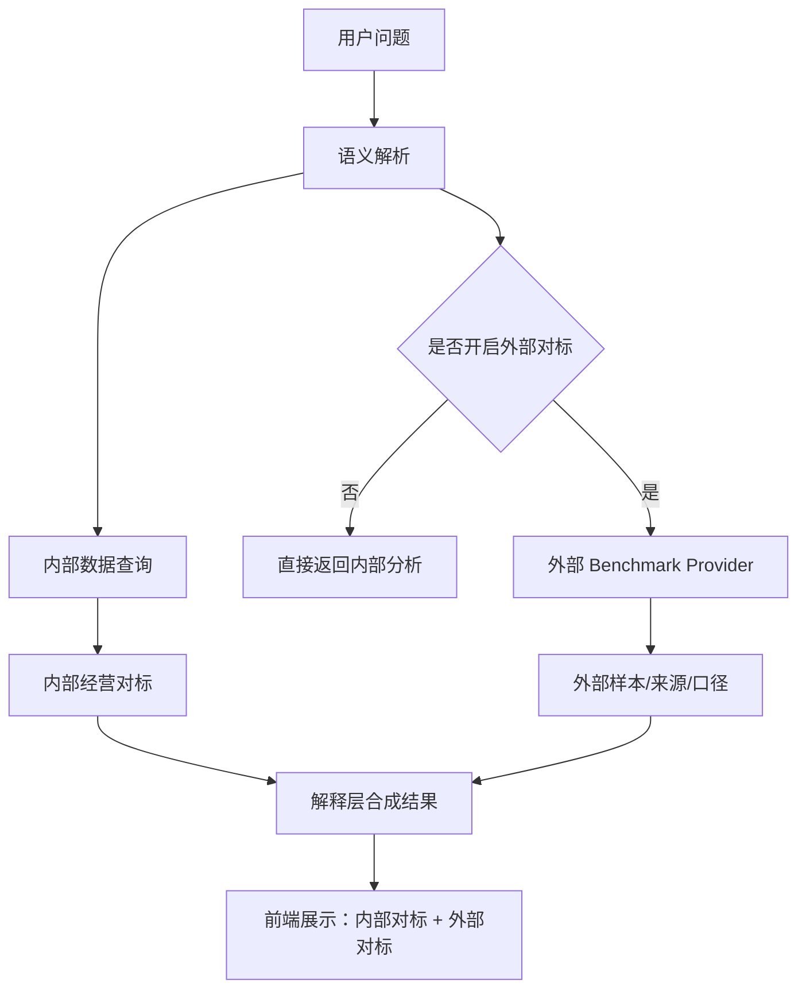

# 外部行业对标 Provider 设计

## 当前状态

当前系统已经具备两层能力：

1. 内部对标：基于公司内部真实数据，优先返回同区域、同品牌、同档次、同城市等级的经营样本均值。
2. 外部对标开关：由用户在前端主动开启，系统才进入“允许联网补充外部行业样本”的模式。

当前版本**还没有直接接入稳定的外部行业数据源**，而是先把外部对标能力抽象成独立 Provider 层，并在结果中明确展示：

- 是否由用户主动开启
- 当前 Provider 名称
- 当前等待状态
- 外部样本的适用维度
- 口径/时效/准确性免责声明

## 为什么要独立成 Provider

外部行业数据与内部经营数据有本质区别：

- 来源不同：公开行业报告、第三方平台、咨询数据库、协会口径、人工上传文件
- 时效不同：有的是月度，有的是季度，有的是滞后发布
- 口径不同：品牌、城市等级、细分市场、样本口径常常不一致
- 风险不同：需要让用户自己判断是否采信

所以外部行业数据不应该直接硬写进主查询链路，而应该通过 Provider 抽象接入。

## 推荐架构



## Provider 输出建议

外部 Provider 不直接返回“结论”，而是返回结构化元数据：

```json
{
  "requested": true,
  "provider": "manual_review",
  "status": "awaiting_provider",
  "dimensions": ["区域：华南区", "子品牌：嘉华", "品牌档次：奢华级"],
  "message": "你已开启外部行业对标。当前系统会先返回内部经营对标，外部行业数据需按所选 Provider 联网补充后再展示。",
  "disclaimers": [
    "外部行业样本的口径、更新频率和覆盖范围可能与公司内部口径不完全一致。",
    "建议把外部行业数据作为相对位置参考，不直接替代内部经营考核口径。"
  ]
}
```

## 后续可接入的 Provider 类型

1. 手工审核型 `manual_review`
   适合项目早期。系统先识别维度并生成需求说明，由运营/分析人员上传外部报告或人工确认数据。

2. 文件导入型 `uploaded_dataset`
   支持用户上传行业月报、市场监测表、品牌对标表，系统统一落地到本地仓库后参与分析。

3. API 联网型 `industry_api`
   对接第三方行业平台、咨询数据库或合作方 API。需要保留来源、抓取时间、口径说明和失败回退策略。

4. 搜索聚合型 `web_research`
   适合没有标准 API 的场景。通过联网搜索抓取公开行业摘要，但必须把来源链接、发布日期和口径提示一起展示。

## 产品交互建议

- 默认关闭外部对标，避免系统擅自联网。
- 用户开启后，先返回内部对标，再展示外部 Provider 状态。
- 外部数据拿不到时，要明确提示“未接入/未抓取成功/来源待确认”，不要伪装成真实行业结论。
- 前端应把内部对标和外部对标分开展示，避免用户混淆来源。

## 环境变量

当前预留：

- `EXTERNAL_BENCHMARK_PROVIDER`
  默认值：`manual_review`

后续可扩展：

- `EXTERNAL_BENCHMARK_TIMEOUT`
- `EXTERNAL_BENCHMARK_CACHE_TTL`
- `EXTERNAL_BENCHMARK_ALLOWED_DOMAINS`
- `EXTERNAL_BENCHMARK_API_KEY`

## 当前阶段结论

当前最合理的策略不是立即把外部联网查询硬塞进主流程，而是：

1. 先把内部对标做实、做快、做清楚。
2. 把外部行业数据抽成独立 Provider 层。
3. 由用户显式开启外部对标。
4. 把来源、时效、口径、免责声明与结果一起展示。

这样可以保证系统既有扩展性，也不会因为外部数据质量不稳定而污染管理层日常使用体验。

## 最新实现进展

当前后端已经把外部对标从单一占位信息，推进成了可分流的 Provider 状态层：

- `manual_review`
  继续作为默认模式，返回等待人工补充的状态、维度说明和免责声明。
- `uploaded_dataset`
  会检查本地外部数据集目录，明确返回“已有数据集”还是“尚未导入数据集”。
- `industry_api`
  会检查外部行业 API 是否已配置，避免前端误以为已经连通。
- `web_research`
  会返回可联网研究状态，并附带允许的域名白名单配置。

同时，系统已经补上学习样本汇总接口：

- `GET /api/v1/system/learning/summary?days=7`

这个接口会汇总最近一段时间的低置信解析、空结果、需要澄清等样本，返回：

- 原因分布
- 指标分布
- 查询对象类型分布
- 阶段分布
- 最近样本

这意味着 `Learning Agent` 已经不只是把样本写入 `learning_inbox`，而是开始具备“可回看、可统计、可用于后续 Harness 挑样本”的基础能力。
