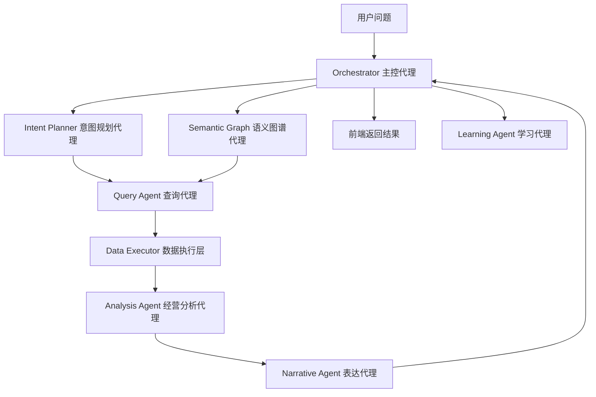
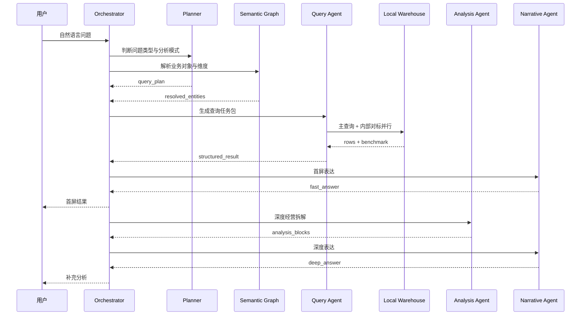

# 高效率多 Agent 编排落地架构

本文档用于回答两个核心问题：

1. 如何把当前系统从“规则 + skill + 单链路问答”升级为真正具备理解力的多 agent 智能助手。
2. 如何在引入多 agent 后，仍然保持移动端管理层可接受的响应速度，而不是把链路做得更慢。

结论先行：

- 多 agent 不等于多轮串行对话。
- 正确做法是“主控编排 + 结构化子代理 + 快慢双速 + 本地执行优先 + 深度分析异步补充”。
- 在线链路必须把“理解、规划、执行、表达”拆开，但不能让每层都走重模型长推理。

## 1. 设计目标

这套架构的目标不是做一个会聊天的通用 Agent，而是做一个面向酒店管理层的经营分析助手：

- 用户只输入自然语言，不输入复杂参数。
- 系统先理解“你到底想看什么”，再决定怎么查。
- 标准问题要快，复杂问题首屏也要快。
- 所有结论都必须可回放、可审计、可学习。
- 规则、图谱、模型、skill 各自承担不同职责，而不是互相覆盖。

## 2. 当前单链路模式为什么会显得“死板”

当前系统的主要问题不是“模型太弱”，而是职责混在一起：

- 语义识别层试图同时做实体识别、意图判断、问题理解。
- skill 同时承担了“理解问题”和“执行模板”两种角色。
- SQL 链路过早介入，导致系统在真正理解用户问题前就进入查数动作。
- 大模型更多在补参数和补表达，没有放在“查询规划”这个真正需要推理的位置。

结果就是：

- 已知表达可以覆盖。
- 用户一旦说得更自然，系统就会退回到死板映射。
- 错误也很难定位，到底是理解错、规划错、查错，还是说错。

## 3. 推荐目标形态

推荐做成“一个主控代理 + 五类专家代理 + 一个学习闭环”的受控多 agent 系统。



关键点：

- 用户永远只面对一个助手。
- 子代理不直接跟用户说话，只返回结构化结果。
- 结构化结果由主控代理统一汇总。

## 4. Agent 分工

### 4.1 Orchestrator 主控代理

职责：

- 接收用户输入和对话上下文。
- 判断走快路径还是深路径。
- 决定本次需要调用哪些子代理。
- 汇总最终响应。
- 管理异步任务和追问建议。

它不应该直接负责细粒度语义理解或 SQL 生成。

### 4.2 Intent Planner 意图规划代理

这是最关键的一层。

职责：

- 判断问题类型：总览、归因、对比、报告、追问、澄清。
- 判断对象层级：单店、酒店群、区域、品牌、管理公司、组合口径。
- 判断分析模式：先汇总、先对比、先归因，还是先澄清。
- 产出结构化查询计划。

例如：

用户问题：

```text
查一下1月份富力所有酒店的总体经营情况
```

Planner 不应该直接回答，而应该先产出：

```json
{
  "query_object_type": "hotel_group",
  "query_object_label": "富力体系酒店集合",
  "time_scope": "202601",
  "analysis_mode": "portfolio_overview",
  "themes": [
    "income_quality",
    "room_efficiency",
    "profit_quality",
    "cost_efficiency",
    "internal_benchmark"
  ],
  "execution_order": [
    "resolve_scope",
    "aggregate_metrics",
    "peer_benchmark",
    "identify_outliers"
  ],
  "needs_clarification": false
}
```

### 4.3 Semantic Graph 语义图谱代理

职责：

- 把自然语言对象映射为业务实体。
- 维护对象之间的从属、包含、别名、层级关系。
- 解决“富力所有酒店”“万达管理嘉华品牌”“餐饮部酒水成本”这类业务表达。

它的底层不应只是词表，而应由三部分组成：

- 维度表与实体目录
- 别名库
- 业务关系图谱

图谱里至少要包含：

- 管理公司
- 品牌 / 子品牌
- 区域
- 城市 / 城市等级
- 酒店
- 科目层级
- 部门层级
- 酒店集合 / 组织口径

### 4.4 Query Agent 查询代理

职责：

- 接收 Planner 的结构化计划。
- 判断该走哪张表、查哪类粒度。
- 拆分成一个或多个查询任务。
- 控制本地缓存、本地仓库、远端数据库、外部 Provider 的优先级。

它输出的应该是“查询任务包”，而不是自然语言。

### 4.5 Analysis Agent 经营分析代理

职责：

- 基于已返回数据做客观拆解。
- 固定按经营框架组织分析。
- 不编造未返回的数据。

推荐固定主题：

- 收入质量
- 客房效率
- 利润质量
- 成本效率
- 横向对标

### 4.6 Narrative Agent 表达代理

职责：

- 把结构化分析块翻译成管理层可读的回答。
- 保持口吻专业、客观、简洁。
- 给出自然追问入口。

它不应该越权决定分析主题，也不应该自行补事实。

### 4.7 Learning Agent 学习代理

职责：

- 收集低置信问题、空结果、用户纠正、二次追问改写。
- 提炼 alias proposal、planner pattern proposal、skill proposal、eval proposal。
- 进入 Harness 验证和人工审核，不直接改线上逻辑。

## 5. 高效率的关键：双速路径

多 agent 想快，必须采用快慢双速。

### 5.1 Fast Path 快路径

目标：`0.3s - 1.5s` 内返回首屏理解和初步结果。

必须包含：

- 上下文继承
- 时间识别
- 语义图谱命中
- Planner 生成简版 query plan
- 本地仓库查询
- 基础结果卡片

Fast Path 输出给用户的内容：

- 我理解你要看什么
- 范围和时间是什么
- 当前先返回哪些核心数字
- 正在继续补充哪些分析

### 5.2 Deep Path 深路径

目标：`1.5s - 6s` 内补充深度经营拆解。

可以包含：

- 组合汇总
- 对标回退
- 异常酒店识别
- P&L 下钻
- 深度模型生成结构化分析

### 5.3 Async Path 异步路径

目标：非阻塞，不影响首屏体验。

适合放这里的任务：

- 外部行业联网对标
- 学习样本沉淀
- 报告导出
- 后台评估
- 定时摘要生成

## 6. 哪些步骤必须快，哪些可以异步

下面是建议的响应预算。

| 步骤 | 责任层 | 是否必须快 | 建议预算 | 说明 |
| --- | --- | --- | --- | --- |
| 对话上下文继承 | Orchestrator | 是 | 10-30ms | 本地内存逻辑 |
| 时间解析 | Planner / Rule | 是 | 10-20ms | 尽量规则化 |
| 实体与维度识别 | Semantic Graph | 是 | 20-80ms | 优先本地图谱 |
| 问题类型判断 | Planner | 是 | 50-150ms | 可用快模型，但必须结构化输出 |
| 生成查询计划 | Planner | 是 | 50-150ms | 不生成自然语言长答案 |
| 本地仓库查询 | Query Agent | 是 | 50-300ms | 优先 DuckDB / 本地缓存 |
| 内部对标聚合 | Query Agent | 是 | 80-300ms | 可以与主查询并行 |
| 基础表达 | Narrative | 是 | 50-150ms | 模板优先 |
| 深度经营拆解 | Analysis Agent | 否 | 0.5-3s | 可在首屏后补齐 |
| P&L 下钻 | Query Agent | 否 | 0.5-2s | 用户需要时优先 |
| 外部行业联网 | External Provider | 否 | 2-10s+ | 必须异步 |
| 学习样本沉淀 | Learning Agent | 否 | 异步 | 不占在线时延 |

一句话：

- 用户眼前必须快的是“理解、识别、主查询、首屏表达”。
- 可以慢的是“深度分析、外部联网、学习闭环”。

## 7. 线上编排原则

### 7.1 能不用模型就不用模型

以下内容应尽量不用大模型：

- 时间识别
- 明确实体映射
- 集合展开
- SQL 执行
- 千位分隔符、指标格式化
- 已知主题的标准表达框架

### 7.2 模型只用在真正需要推理的地方

模型最适合承担：

- 问题类型判断
- 查询规划
- 模糊维度消歧
- 深度经营分析表达

不适合承担：

- 数据事实来源
- 任意 SQL 生成
- 没数据时自由发挥

### 7.3 能并行的必须并行

建议并行的任务：

- 主查询和内部对标
- 主查询和异常酒店识别
- 结果返回和学习样本沉淀
- 结果返回和外部对标异步抓取

### 7.4 所有代理都必须结构化输出

不要让子代理自由生成长文本。

建议输出约束：

- Planner -> `query_plan`
- Semantic Graph -> `resolved_entities`
- Query Agent -> `query_bundle`
- Analysis Agent -> `analysis_blocks`
- Narrative Agent -> `final_answer`

## 8. 推荐的在线执行链路



## 9. 前端体验如何配合这套架构

移动端体验不能只等最后一个答案出来。

推荐展示为三段：

### 9.1 第一段：即时理解反馈

发送后立即显示：

- 已识别范围
- 已识别时间
- 已识别问题类型
- 正在读取哪些数据

### 9.2 第二段：首屏经营总览

尽快给用户：

- 核心指标卡
- 内部对标卡
- 识别口径卡

### 9.3 第三段：渐进补充

随后追加：

- 收入质量
- 客房效率
- 利润质量
- 成本效率
- 横向对标
- 后续追问建议

这样即使深度链路还在跑，用户也不会觉得系统“卡住了”。

## 10. 实施优先级

建议分三期落地。

### 第一期：先立 Planner 和 Semantic Graph

目标：

- 先解决“理解死板”的问题。
- 让系统会判断“单店 / 多店 / 组合 / 总览 / 归因 / 对比”。

交付：

- `query_plan` 结构
- `resolved_entities` 结构
- 组合查询基础链路

### 第二期：补齐 Query Agent 和 Analysis Agent

目标：

- 让系统从“会识别”升级为“会组织分析”。

交付：

- 主查询 / 对标 / 异常下钻并行
- 标准经营分析 blocks
- 组合总览问题专门支持

### 第三期：补齐 Narrative 和 Learning

目标：

- 让结果真正像管理层经营助理。
- 让系统持续学习而不是一直靠手工配。

交付：

- 管理层表达模板
- Learning Inbox -> Proposal -> Harness -> Review 闭环
- 外部行业 Provider 层

## 11. 与 Skill / Harness / Hermes 的关系

这套方案不是替代 Skill / Harness / Hermes，而是重新给它们定位：

- Skill：从“理解问题的主入口”降级为“已知分析动作的执行模板”
- Harness：负责离线验证 Planner、Graph、Query、Answer 的质量
- Hermes / Agent 思想：吸收其可组合、可学习、可观察的优点，但不照搬高自治模式

## 12. 最终原则

最终应坚持这几条原则：

- 理解和执行必须解耦。
- 多 agent 必须受控编排，而不是自由对话。
- 快路径优先服务移动端体验。
- 深路径负责补充分析，不阻塞首屏。
- 外部联网能力必须显式开启，并标明来源与风险。
- 学习闭环只能产生候选改进，不能直接改线上逻辑。

如果按这个架构推进，系统会从“会匹配的问答系统”逐步升级成“会理解、会规划、会分析、还能持续学习的经营分析助手”。
