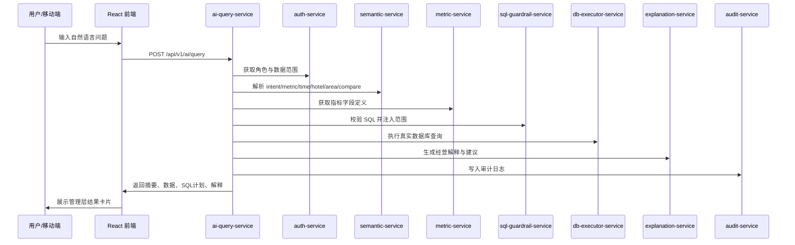

# 酒店经营 AI 助手项目复盘与技术框架

本文档用于项目交付、团队接手和后续迭代。它总结当前版本的建设过程、系统目标、技术架构、数据链路、模型策略、调优方法和已知边界。

补充说明：如果想先快速了解“当前实际代码架构、服务调用图、数据流和后续重构重点”，建议先阅读 `docs/ARCHITECTURE_OVERVIEW.md`。如果后续要把当前单链路问答架构演进为“高效率多 Agent 智能助手”，再结合 `docs/HIGH_EFFICIENCY_MULTI_AGENT_ARCHITECTURE.md` 一起阅读。后者重点定义了主控代理、意图规划、语义图谱、查询执行、经营分析、表达生成和学习闭环的职责边界，以及哪些步骤必须快、哪些步骤适合异步。若要查看第三阶段最近一轮“Learning Agent + External Benchmark Provider”具体做了什么、如何验证、当前结果是什么，可直接阅读 `docs/PHASE3_EXECUTION_LOG.md`。若要查看“酒店经营 AI 助手如何在基础交互体验上向 ChatGPT 看齐”的差距、产品需求和优先级拆解，可直接阅读 `docs/CHATGPT_EXPERIENCE_ALIGNMENT_PLAN.md`。从现在开始，`docs/` 目录统一按 `docs/DOCUMENTATION_STANDARDS.md` 进行规范管理，目录入口见 `docs/README.md`。

## 1. 项目目标

本项目面向酒店集团管理层，核心目标是把经营数据查询和经营分析压缩到一个移动端对话入口里：

- 用户尽量只通过一个对话框提问，例如“广州丽思卡尔顿酒店3月的收入情况怎么样？”。
- 系统自动识别酒店、区域、月份、指标、对比口径和分析意图。
- 查询真实经营宽表数据，并返回管理层可读的结论、核心数据、风险提示和行动建议。
- 输出应以客观数据拆解为主，避免直接给出“健康/承压/好坏”等未必准确的经营定性。
- 支持连续追问，例如“继续展开原因”“只看华南区”“换成经营摘要”。
- 支持常用快捷提问、模型配置、回答模板和调优阶段的系统化配置。

当前定位是“可本地运行、可移动端演示、可继续生产化改造”的交付包。

## 2. 建设过程回顾

项目从一个交付包雏形逐步演进为可连接真实数据和大模型的经营分析助手，主要经历了以下阶段：

1. 项目文档和启动方式梳理

   初始阶段阅读了项目文档，确定本地 Windows 启动优先，补齐一键启动、停止和 smoke check 流程。

2. 移动端对话式体验改造

   用户对象明确为管理层、主要移动办公后，前端从偏表单式输入收敛为移动优先的聊天界面。高级参数默认折叠，主入口保持一个对话框。

3. 前端交互回归

   针对快捷提问、继续追问、详情展开、报告模式等按钮补充 Playwright 移动端测试，确保每个按钮有交互反馈。

4. 真实数据接入

   从 CSV/SQL 资料过渡到阿里云 MySQL 数据库。当前核心数据源包括：

   - `wddm_dim_overview_cockpit_f`：经营概览宽表。
   - `vw_pnl_fact`：利润表明细视图。
   - `dim_allhotel_slcp`：酒店名称和区域映射维表。

5. 千问大模型接入

   通过 OpenAI 兼容接口接入阿里云 DashScope 千问模型，形成快慢双模型策略：

   - 快模型：负责语义解析、容错、澄清追问。
   - 深度模型：负责经营解释、管理层摘要、风险和建议表达。

6. 真实问题驱动修复

   根据测试反馈持续修复自然语言识别和经营解释问题，例如：

   - “本月哪些酒店经营利润未达预算？”识别为经营利润、预算对比、低于预算方向。
   - “看一下江门嘉华酒店3月的经营情况”识别为单店、202603、经营利润、预算对比。
   - “广州丽思卡尔顿酒店3月的收入情况怎么样？”识别为单店、202603、总收入、预算对比，并区分酒店和公寓。

7. 可配置化和可观察性增强

   新增 `app_settings.yaml`，把快捷提问、模型配置、回答模板、调优阶段从代码中抽出，并通过前端高级设置展示，减少黑箱感。

## 3. 当前技术框架

### 3.1 前端

前端目录：`frontend`

主要技术：

- React 18
- TypeScript
- Vite
- Playwright 移动端 E2E

核心文件：

- `frontend/src/App.tsx`：移动端聊天主界面、上下文追问、结果卡片、高级设置展示。
- `frontend/src/components/QuickQuestions.tsx`：快捷提问组件，支持后端配置下发。
- `frontend/src/lib/api.ts`：封装问答、报告、系统设置 API。
- `frontend/src/styles.css`：移动端视觉和交互样式。
- `frontend/tests/management-chat.spec.ts`：移动端交互回归测试。

交互特点：

- 默认只有一个输入框。
- 快捷提问可直接点击发送。
- 结果展示包括管理层速览、核心数据 Top 5、风险提示、结构化数据、SQL 计划。
- 经营解释按收入质量、客房效率、利润质量、成本效率、横向对标拆解；缺失维度必须明确说明未取数。
- 连续追问会结合上一轮酒店、区域、指标、月份自动改写。
- 高级设置中展示输出模式、时间范围、角色、模型配置、调优阶段、回答模板。

### 3.2 后端

后端目录：`backend/apps`

当前由 8 个 FastAPI 服务组成：

| 服务 | 端口 | 职责 |
| --- | --- | --- |
| `ai-query-service` | 8100 | 对外统一入口，编排语义、指标、SQL、数据库、解释、审计 |
| `semantic-service` | 8101 | 自然语言语义解析，输出结构化查询参数 |
| `metric-service` | 8102 | 指标字典服务，返回指标字段映射 |
| `sql-guardrail-service` | 8103 | SQL 安全校验和权限范围注入 |
| `explanation-service` | 8104 | 经营解释、报告段落、风险和建议生成 |
| `auth-service` | 8105 | 返回角色、权限和数据范围 |
| `db-executor-service` | 8106 | 执行数据库查询，连接 MySQL |
| `audit-service` | 8107 | 记录查询审计日志 |

主要配置文件：

- `backend/configs/semantic_mapping.yaml`：自然语言词典、意图词、对比口径词。
- `backend/configs/metric_dictionary.yaml`：指标定义、中文名、别名、宽表字段映射。
- `backend/configs/sql_guardrails.yaml`：SQL 禁止模式和非加总指标规则。
- `backend/configs/app_settings.yaml`：快捷提问、模型配置、回答模板、调优阶段。
- `backend/configs/entity_catalog.yaml`：从 `C:\Project\HotelAgent\basedata` 加载酒店、区域、品牌、管理方等基础实体词库。
- `backend/skills/registry.yaml`：管理启用的业务 Skill，目前包括单店收入情况和单店经营利润情况。

## 4. 查询链路

一次普通问答请求的链路如下：



## 5. 数据和指标设计

### 5.1 当前核心数据源

当前真实数据来自阿里云 MySQL：

- 数据库：`hotel_ai`
- 概览宽表：`wddm_dim_overview_cockpit_f`
- 明细视图：`vw_pnl_fact`
- 酒店维表：`dim_allhotel_slcp`

注意：密钥、密码和 API Key 不应写入文档或代码，应继续通过 Windows 用户环境变量或部署环境变量注入。

### 5.2 当前指标

当前已配置的指标包括：

| 指标代码 | 中文名 | 主要用途 |
| --- | --- | --- |
| `OPERATING_PROFIT` | 经营利润 | 预算达成、未达预算、归因分析 |
| `TOTAL_INCOME` | 总收入 | 收入情况、同比、预算对比 |
| `REVPAR` | 每房收益 | 酒店经营效率分析 |

每个指标支持 MTD 口径字段：

- `actual`：实际值
- `budget`：预算值
- `last_year`：去年同期

### 5.3 酒店名称识别

系统支持用户输入酒店全称或简称，并通过 SQL 条件做兼容匹配。例如：

- 用户输入“江门嘉华酒店”，可匹配“江门嘉华酒店”和“江门嘉华”。
- 用户输入“广州丽思卡尔顿酒店”，会保留“酒店”后缀，避免误带出“广州丽思卡尔顿公寓”。

## 6. 大模型策略

当前模型接入采用 OpenAI 兼容接口，可连接阿里云 DashScope。

环境变量：

- `QWEN_API_BASE_URL`
- `QWEN_API_KEY`
- `QWEN_MODEL`
- `QWEN_FAST_MODEL`
- `QWEN_DEEP_MODEL`
- `QWEN_TIMEOUT`

推荐策略：

- `QWEN_FAST_MODEL=qwen3.5-flash`
- `QWEN_DEEP_MODEL=qwen3.6-plus`

职责划分：

- 快模型不直接生成 SQL，只辅助解析自然语言，输出系统需要的结构化参数。
- 规则引擎负责兜底和关键约束，避免小模型把明确参数改错。
- 深度模型只在已有真实数据结果基础上增强表达，不替代数据库计算。

当前 `semantic-service` 会输出 `parse_debug`，用于观察语义解析阶段：

- 命中了哪个指标词。
- 命中了哪个对比口径。
- 是否使用快模型。
- 快模型给出的候选参数。

## 7. 调优方法

建议后续反馈按四个阶段拆开，不要把问题笼统归为“模型不准”。

### 7.1 第一阶段：语义解析

观察位置：

- 前端结果里的“查看结构化数据”
- `parsed_intent`
- `parse_debug`

判断标准：

- `metric_code` 是否正确。
- `compare_mode` 是否正确。
- `time_scope` 是否正确。
- `requested_hotels` 和 `requested_areas` 是否正确。
- `intent` 是否为 `query/report/explain/rank` 中合理值。

如果这一层错，应调：

- `semantic_mapping.yaml`
- `semantic-service` 的规则解析
- 快模型 prompt

### 7.2 第二阶段：SQL 生成

观察位置：

- 前端结果里的“查看 SQL 计划”
- `sql_plan.rewritten_sql`

判断标准：

- 是否查对表。
- 是否选对字段。
- `WHERE` 中月份、酒店、区域、方向过滤是否正确。
- 排序是否符合问题意图。

如果这一层错，应调：

- `metric_dictionary.yaml`
- `ai-query-service` 的 SQL 构造逻辑
- `sql-guardrail-service`

### 7.3 第三阶段：数据执行

观察位置：

- 核心数据 Top 5
- `data_points`
- `db-executor-service`

判断标准：

- 是否返回真实酒店。
- 是否出现示例酒店。
- 金额、差额、差异率是否合理。

如果这一层错，应调：

- 数据库连接环境变量。
- MySQL 表/视图字段。
- 酒店维表映射。

### 7.4 第四阶段：经营解释

观察位置：

- 管理层速览
- 主要风险提示
- 建议
- `explanation.report_sections`

判断标准：

- 是否先说结论。
- 是否说明正负数含义。
- 是否给出可执行建议。
- 是否避免空泛套话。

如果这一层错，应调：

- `explanation-service`
- 深度模型 prompt
- `app_settings.yaml` 中回答模板

## 8. 当前验证方式

### 8.1 后端单测

```powershell
.\.venv\Scripts\python.exe -m unittest discover -s backend\tests
```

当前覆盖：

- 语义解析
- 酒店月份问题识别
- SQL 生成
- 系统设置接口
- 解释服务基础返回
- Harness 语义和 SQL 业务评测

### 8.1.1 Harness 业务评测

```powershell
.\.venv\Scripts\python.exe backend\evals\run_eval.py --write-report
```

当前 Harness 会离线加载语义服务、指标服务和 SQL 构造逻辑，固定关闭大模型解析，检查高频问题的 `parsed_intent` 和 SQL 关键断言。报告会写入 `backend/evals/reports`。

### 8.1.2 Learning Inbox 汇总

```powershell
.\.venv\Scripts\python.exe backend\evals\summarize_learning_inbox.py
```

Learning Inbox 会记录需要后续学习的样本，包括需要澄清、低置信度、空结果、上游 fallback 或 warning。样本写入 `backend/runtime/learning_inbox`，用于后续生成候选同义词、候选 Skill 示例或候选 eval case。

### 8.2 前端构建

```powershell
cd frontend
npm run build
```

### 8.3 移动端 E2E

```powershell
cd frontend
npm run test:e2e -- --timeout=30000
```

当前覆盖：

- 发送按钮
- 快捷提问
- 连续追问
- 高级设置展示
- 报告模式
- 结构化详情展开

### 8.4 服务 smoke check

```powershell
.\.venv\Scripts\python.exe .\scripts\smoke_check.py
```

当前覆盖：

- 前端端口
- 8 个后端服务健康检查
- 问答接口
- 报告接口

## 9. 本地启动和访问

推荐启动：

```powershell
.\scripts\start_local.ps1
```

停止：

```powershell
.\scripts\stop_local.ps1
```

本机访问：

- 前端：`http://127.0.0.1:3000`
- 后端：`http://127.0.0.1:8100`

局域网访问：

- 前端：`http://<内网IP>:3000`
- 后端：`http://<内网IP>:8100`

注意：如需手机访问，需要 Windows 防火墙允许 3000 和 8100 入站，且前后端已经绑定 `0.0.0.0`。

## 10. 当前能力边界

已经具备：

- 移动端对话式问答。
- 单店、区域、月份、指标识别。
- 预算对比和同比查询。
- 经营利润、总收入、RevPAR 指标。
- 真实 MySQL 查询。
- 管理层摘要、风险和建议。
- 连续追问。
- 可配置快捷提问、模型配置、回答模板和调优阶段。
- 基础审计日志。

仍需后续加强：

- 权限和审计目前按“后续增强”处理，角色范围仍较简化。
- 指标字典还需要扩展更多经营指标，例如客房收入、餐饮收入、入住率、平均房价、人工成本等。
- 横向分析可以继续增强行业行情、区域市场和同行对标数据。
- 解释层需要更多业务模板，避免复杂问题时表达泛化。
- 生产部署需要补齐统一网关、鉴权、HTTPS、密钥管理、日志监控和异常告警。

## 11. 建议下一步

建议优先级如下：

1. 扩充指标字典和真实字段映射。
2. 梳理 20-30 个管理层高频问题，加入 `app_settings.yaml`。
3. 为每个高频问题建立“期望 parsed_intent + SQL 计划 + 示例答案”的回归样本。
4. 增强 explanation-service 的业务模板，尤其是收入、利润、成本、出租率、RevPAR 的不同解释框架。
5. 接入更严格的权限范围和用户体系。
6. 增加生产化部署文档和监控方案。

如果继续推进自学习和配置治理，建议参考 `docs/SKILL_HARNESS_EVOLUTION_PLAN.md`。该文档给出了 Skill Registry、Harness 评测、Learning Inbox、基础数据实体化和受控发布机制的下一阶段设计。
